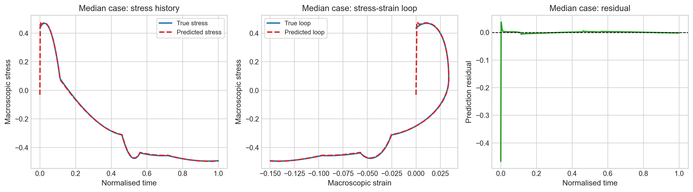
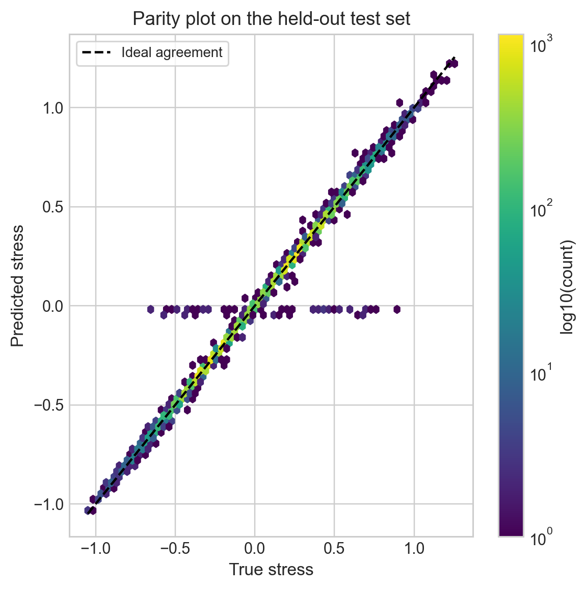
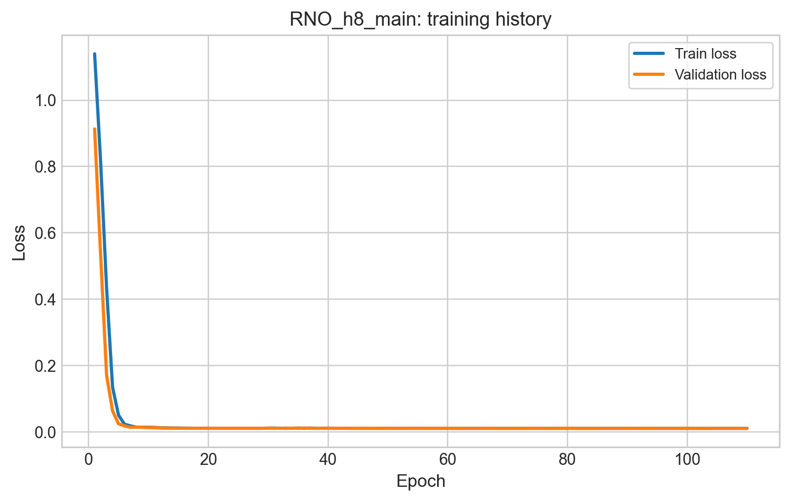
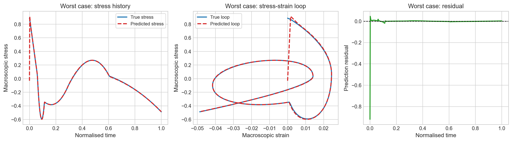
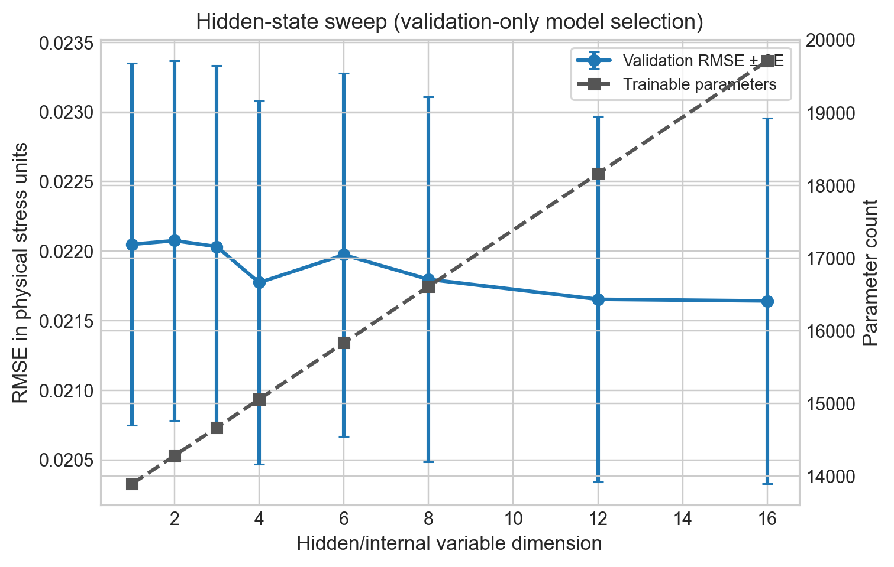

# Recurrent Neural Operator for Visco-Plasticity

[](pyproject.toml)
[](https://pytorch.org)
[](LICENSE)

A data-driven constitutive model for a 1D visco-plastic composite. A **Recurrent Neural Operator (RNO)** is trained on unit-cell simulations to map macroscopic strain history to macroscopic stress. Its recurrent hidden state acts as a set of *learned internal variables*, and a sweep over the hidden-state size estimates how many internal variables the material actually needs.

<p align="center">
  
  <br><em>Median-error held-out trajectory: stress history, stress–strain loop and residual.</em>
</p>

## Highlights

- **Test R² = 0.996** and relative L2 error ≈ 6% on held-out trajectories, with ~16.6k parameters.
- **Hysteresis and rate-dependence captured.** Predicted stress–strain loops track loading, unloading and reloading branches.
- **Internal-variable count from data.** Under a one-standard-error rule, a **single hidden variable** matches the validation accuracy of models with up to 16.
- **Leakage-safe protocol.** Normalisation is fitted on the training split only, the hidden size is selected on validation only, and the test split is touched once.

## The problem

In a visco-plastic material, stress depends on the whole loading history, not just the current strain. Classical models encode that history in hand-designed internal variables (plastic strain, back-stress, …) evolved by an ODE. The RNO learns both the internal variables and their evolution law directly from simulation data:

$$
\bar{\sigma}(t) = \mathcal{F}\big[\,\bar{\epsilon}(\tau),\ \tau \le t\,\big]
$$

The dataset contains 400 strain–stress trajectories from unit-cell simulations of a visco-plastic composite. Each trajectory is downsampled to 501 time steps on normalised time $t \in [0, 1]$ and split 280 / 60 / 60 into train / validation / test.

## Model

At each step the input is $x_t = [\bar{\epsilon}_t,\ \dot{\bar{\epsilon}}_t]$: the normalised strain and a backward-difference strain rate. A gated recurrent update evolves the hidden state $h_t \in \mathbb{R}^{k}$, which is then decoded to stress:

$$
\begin{aligned}
u_t &= [\,x_t,\ \hat{\sigma}_{t-1},\ h_{t-1}\,] \\
c_t &= \tanh\big(\mathrm{MLP}_c(u_t)\big), \qquad g_t = \mathrm{sigmoid}\big(\mathrm{MLP}_g(u_t)\big) \\
h_t &= \mathrm{LayerNorm}\big((1 - g_t) \odot h_{t-1} + g_t \odot c_t\big) \\
\hat{\sigma}_t &= \mathrm{MLP}_{\text{out}}\big([\,x_t,\ h_t\,]\big)
\end{aligned}
$$

The gate lets memory evolve smoothly: elastic-like steps leave $h$ nearly unchanged, and yielding events overwrite it. Training minimises MSE, plus a per-trajectory relative-L2 term (weight 0.1) and a Smooth-L1 term (weight 0.05). It uses AdamW, ReduceLROnPlateau, gradient clipping, early stopping, and mixed precision on CUDA.

## Results

Metrics are in physical stress units for the main model ($k = 8$, 16,610 parameters):

| Split      | RMSE   | MAE    | Relative L2 | R²     |
|------------|--------|--------|-------------|--------|
| Train      | 0.0221 | 0.0036 | 0.0658      | 0.9957 |
| Validation | 0.0219 | 0.0035 | 0.0641      | 0.9959 |
| **Test**   | **0.0208** | **0.0034** | **0.0599** | **0.9964** |

Train, validation and test errors are almost identical, so the model generalises rather than memorises.

<p align="center">
  
  &nbsp;
  
</p>

The horizontal band at σ̂ ≈ 0 in the parity plot comes from the **first time step**, where the model has no history yet. That initial transient is the dominant error source, even in the worst-case trajectory:

<p align="center">
  
</p>

### How many internal variables?

The hidden-state size $k$ was swept over {1, 2, 3, 4, 6, 8, 12, 16}, and each model was scored on validation RMSE with standard errors across trajectories. Every size sits on the same plateau. Going from $k=1$ to $k=16$ improves RMSE by only ~1.9% while adding ~42% more parameters. The one-standard-error rule therefore selects **$k = 1$** as the empirical minimum for this dataset.

<p align="center">
  
</p>

## Quickstart

Requires [uv](https://docs.astral.sh/uv/).

```bash
git clone https://github.com/ebinezer-rajaram/recurrent-operator-viscoplasticity.git
cd recurrent-operator-viscoplasticity
uv sync
```

`uv sync` installs the default PyTorch wheel from PyPI. For GPU training, install a CUDA build that matches your driver ([pytorch.org](https://pytorch.org/get-started/locally/)).

### Data

The training data (`viscodata_3mat.mat`) was supplied with the course and is **not redistributed** here. Place it in the repository root, or pass `--data_path`. Any MATLAB file with 2D `(samples × time)` arrays named `epsi_tol`/`sigma_tol` (or `strain`/`stress`, `epsilon`/`sigma`) will work. Both v5 and v7.3 (HDF5) formats are supported.

### Train

```bash
# Main model only
uv run python RNO_1d.py

# Main model + hidden-state sweep (reproduces the results above)
uv run python RNO_1d.py --batch_size 128 --run_hidden_sweep --disable_compile_model --num_workers 0
```

Useful flags: `--hidden_dim`, `--epochs`, `--sweep_epochs`, `--downsample`, `--device {auto,cpu,cuda}`, `--disable_amp`, `--deterministic`. Run `--help` for the full list.

### Outputs

Each run writes to `--output_dir` (default `outputs/`):

```
outputs/
├── figures/      loss curves, parity plot, best/median/worst trajectories, sweep plot (PNG + PDF)
├── tables/       per-split metrics, model summary, sweep results, data-split indices
├── logs/         config, environment, normalisation statistics, per-epoch history
└── checkpoints/  best-validation weights for each model
```

## Context

Developed for the Cambridge Engineering Tripos Part IIB module **4C11** (University of Cambridge, Department of Engineering).

## License

[MIT](LICENSE)
